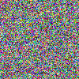

# Procedural Content Generation

A repository for the proposed new unit Procedural Content Generation.

This code is very much work in progress just to throw ideas around and see how easily we can generate the content we need using minimal 3rd party libraries in python.

# [canvas.py](canvas.py)

A simple example of using the canvas should produce an image like this

# [dla.py](images/dla.png)

A simple diffusion limited aggregation example should produce an image like this

# [circle.py](images/circle.png)

A simple example of using the canvas to draw a circle and move it around the screen.

# [splat.py](images/splat.png)

A simple example of using splines to draw a splat and move it around the screen.

